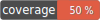

# Aegisora State Transition Rule


[](LICENSE)


State Transition Rule provides a simple, rule-based state transition validation implementation for the Aegisora ecosystem.

It is built on top of aegisora/rule-contract (https://github.com/Aegisora/rule-contract) and follows its strict validation architecture, ensuring consistent and predictable behavior across applications.

This rule is useful for validating workflows, status changes, lifecycle transitions, and domain state machines.

---

## ✨ Features
- 🔹 Lightweight and dependency-free except aegisora/rule-contract
- 🔹 Validates transitions between named states
- 🔹 Supports explicit allowed transition maps
- 🔹 Supports array-based transition map creation
- 🔹 Ignores invalid raw map data safely
- 🔹 Deduplicates source states and transition states
- 🔹 Fully compatible with Aegisora validation pipeline
- 🔹 Strict `Context` → `Result` validation flow
- 🔹 No raw booleans — only structured results
- 🔹 Safe execution via base `Rule` abstraction
- 🔹 Simple factory API (create)
- 🔹 Ready to use out of the box

---

## 📦 Installation

```
composer require aegisora/state-transition-rule
```

---

## 🚀 Core Concept

This package implements a single validation rule:

- accepts a `StateTransition` value via `Context`
- checks whether transition `from` source state `to` target state is allowed
- returns a standardized `Result`

A transition is represented by two states:

`from → to`

Example:

`draft → paid`

The rule validates this transition against configured allowed transition maps.

---

## 🏗️ Basic Usage

```
use Aegisora\RuleContract\Models\Context;
use Aegisora\Rules\StateTransition\Models\State;
use Aegisora\Rules\StateTransition\Models\StateTransition;
use Aegisora\Rules\StateTransition\Models\StateTransitionMap;
use Aegisora\Rules\StateTransition\Models\StateTransitionMaps;
use Aegisora\Rules\StateTransition\StateTransitionRule;

$allowedTransitions = StateTransitionMaps::create([
    StateTransitionMap::create(State::create('draft'), [ State::create('paid'), State::create('cancelled'),]),
    StateTransitionMap::create( State::create('paid'), [ State::create('shipped'), State::create('refunded'),]),
]);

$transition = StateTransition::create(State::create('draft'), State::create('paid'));
$result = StateTransitionRule::create($allowedTransitions)->validate(Context::create($transition));

if ($result->isValid()) {
    // transition is allowed
} else {
    // transition is not allowed
}
```

---

## 🧩 Array-Based Configuration

Allowed transitions may be created from raw array data using `StateTransitionMaps::createFromArray()`.

```
use Aegisora\RuleContract\Models\Context;
use Aegisora\Rules\StateTransition\Models\State;
use Aegisora\Rules\StateTransition\Models\StateTransition;
use Aegisora\Rules\StateTransition\Models\StateTransitionMaps;
use Aegisora\Rules\StateTransition\StateTransitionRule;

$allowedTransitions = StateTransitionMaps::createFromArray([
    [ 'draft' => [ 'paid', 'cancelled', ],],
    [ 'paid' => [ 'shipped', 'refunded', ],],
    [ 'shipped' => [ 'completed',],],
]);

$transition = StateTransition::create(State::create('paid'), State::create('shipped'));
$result = StateTransitionRule::create($allowedTransitions)->validate(Context::create($transition));

if ($result->isValid()) {
    // paid → shipped is allowed
}
```

---

## ⚖️ License

This package is open-source and licensed under the MIT License. See the LICENSE for details.

---

## 🌱 Contributing

Contributions are welcome and greatly appreciated!. See the CONTRIBUTING for details.

---

## 🌟 Support

If you find this project useful, please consider giving it a star on GitHub!

It helps the project grow and motivates further development.
